Запускаем тесты, видим, что они прошли успешно
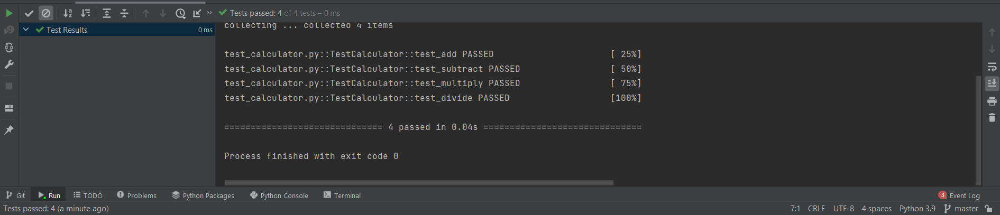

Допустим ошибку в скрипте, чтобы увидеть, что тест выдаст ошибку

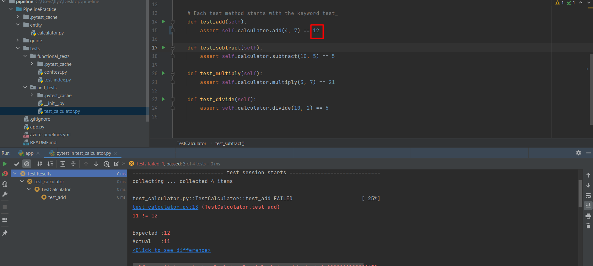

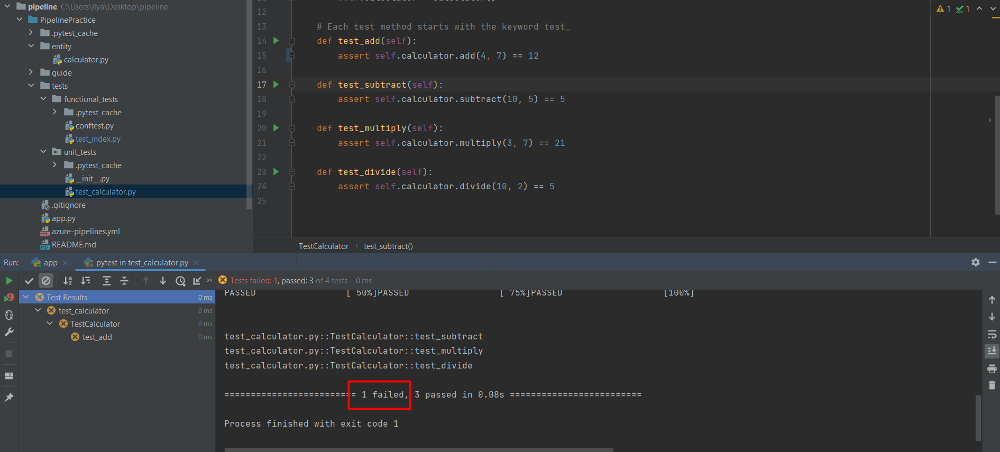

Теперь запустим сервер, чтобы провести новое тестирование

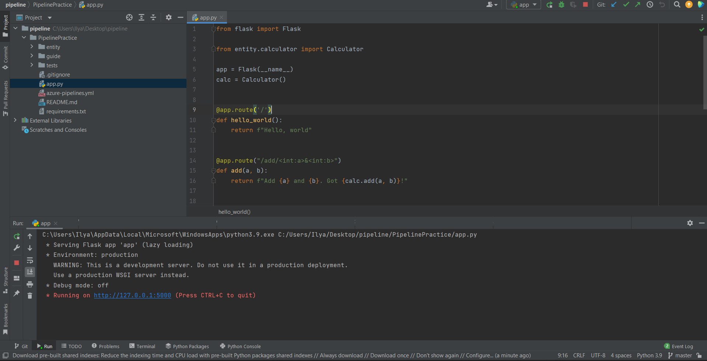

Запускаем тест

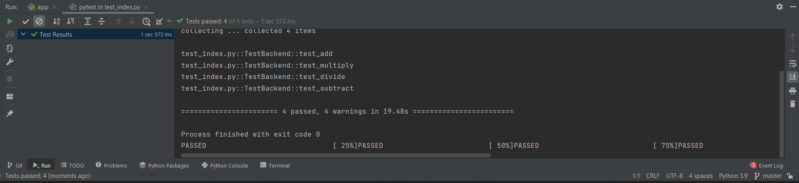

Теперь сделаем ошибку, чтобы завалить тест

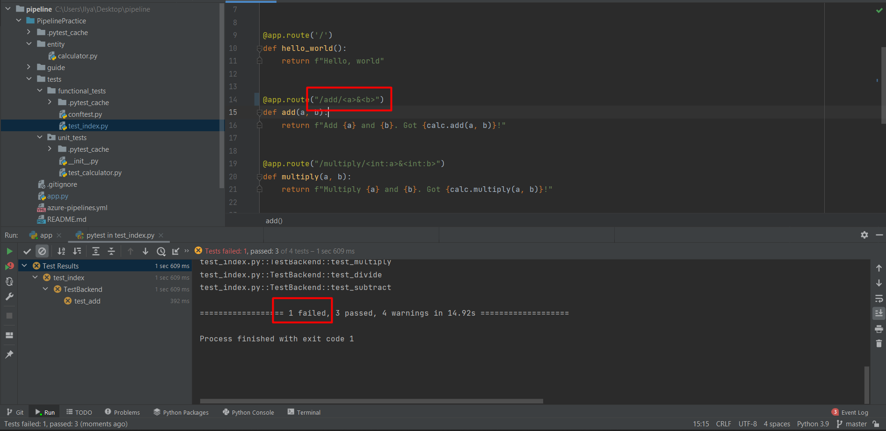

Вернули всё на этап, когда не было ошибок.

## Работа с Azure

Создал проект для веб-приложения

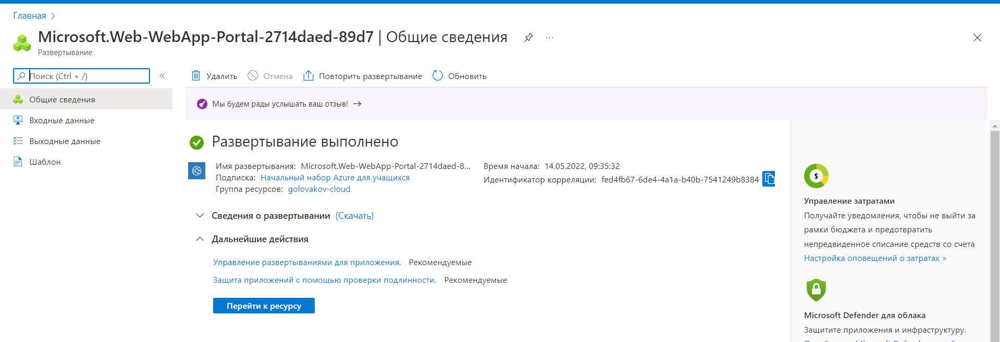

Проверим его работоспособность и убедимся, что всё хорошо

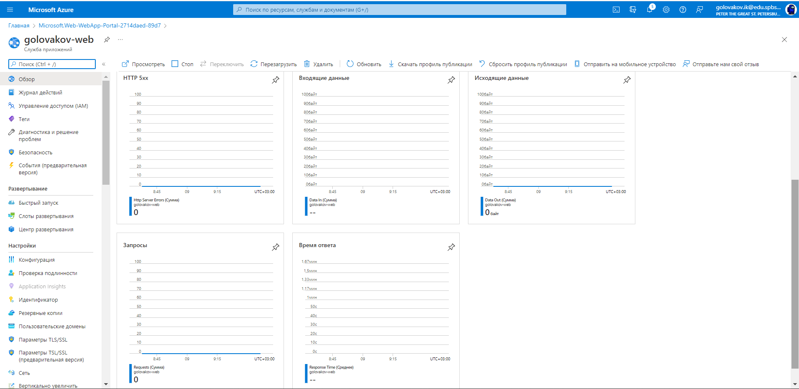

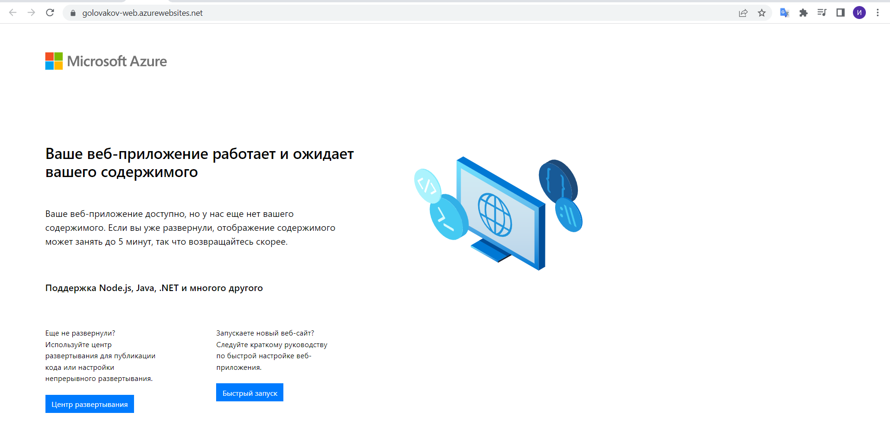

Подключим к Azure свой репозиторий 

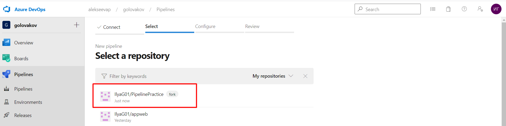

Переходим в пайплайн. Выполним все stages
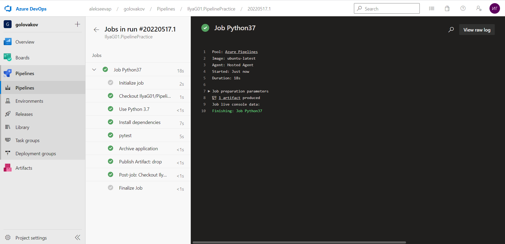
Видим, что опубликован артефакт.
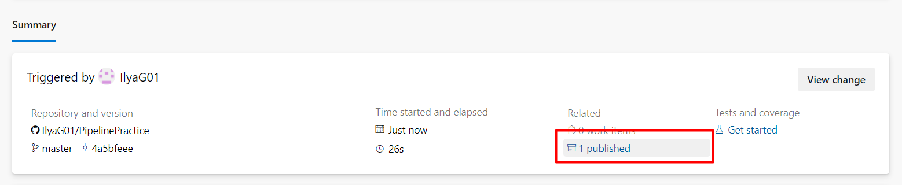

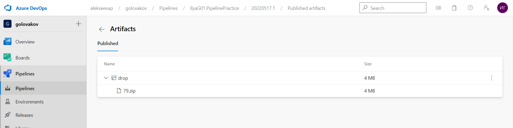

Создаем release в Pipeline. Проводим настройку

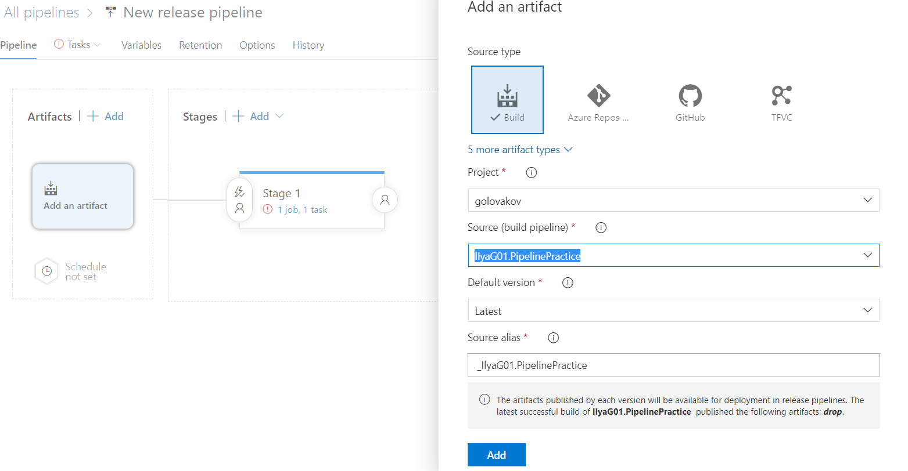

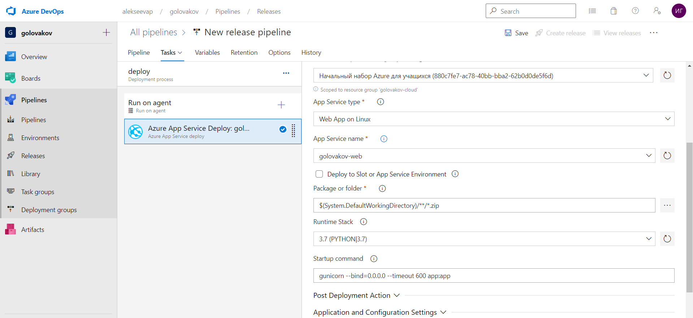

Проводим тесты и видим, что тесты прошли успешно

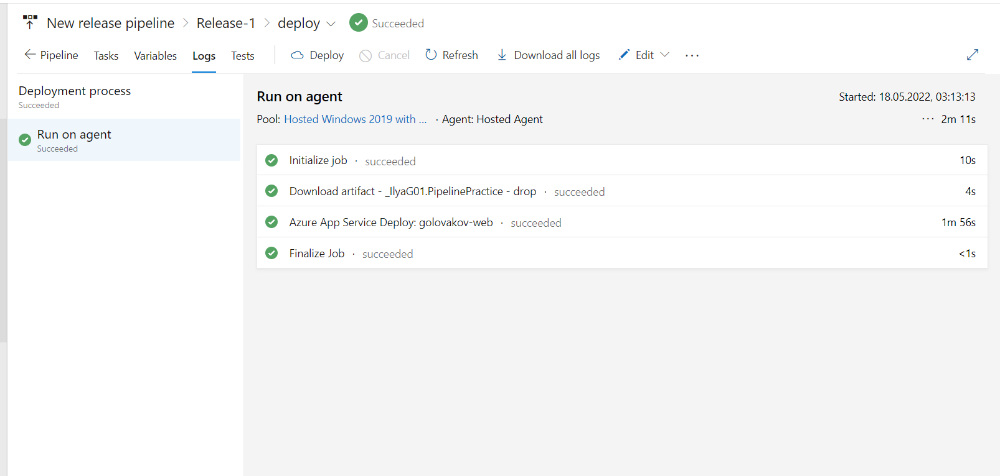

Переходим на сайт и видим, что он работает

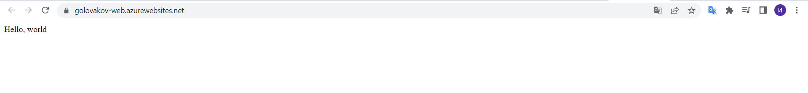

Теперь настраиваем функциональное тестирование. Добавим еще один stage и настроим его

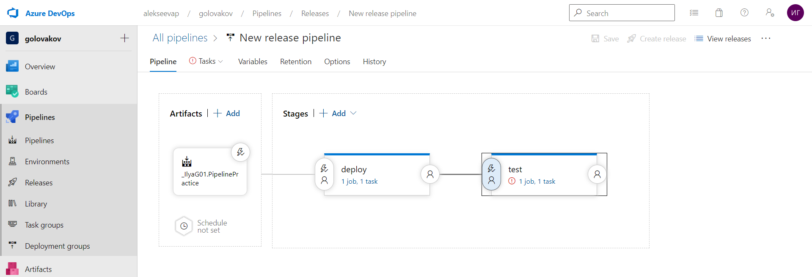

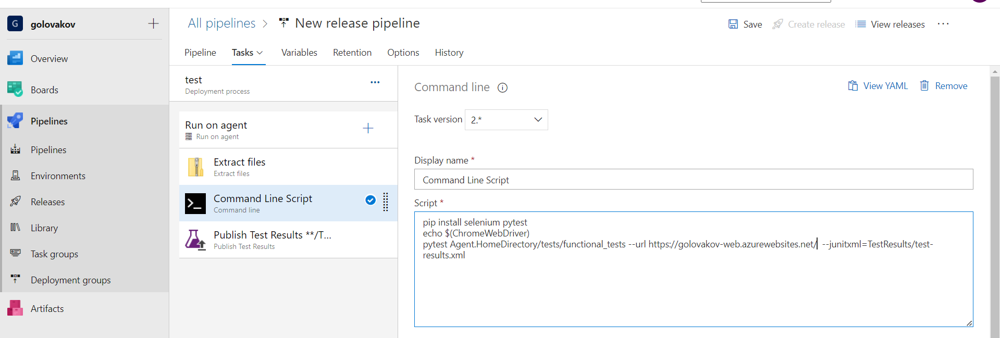

Запускаем тесты и видим, что всё выполнилось

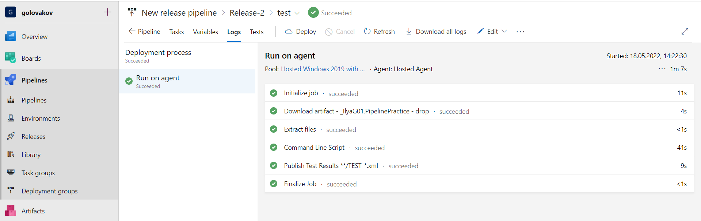

Смотрим результаты

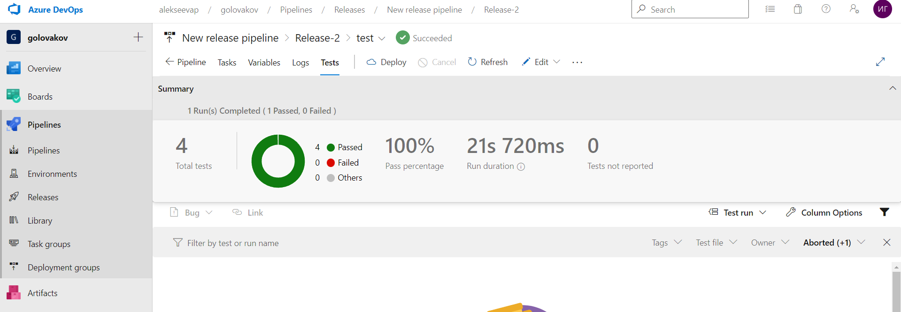

